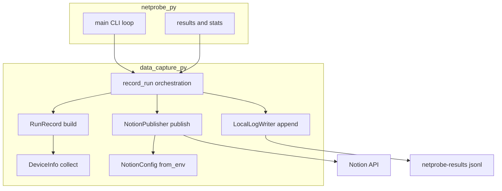
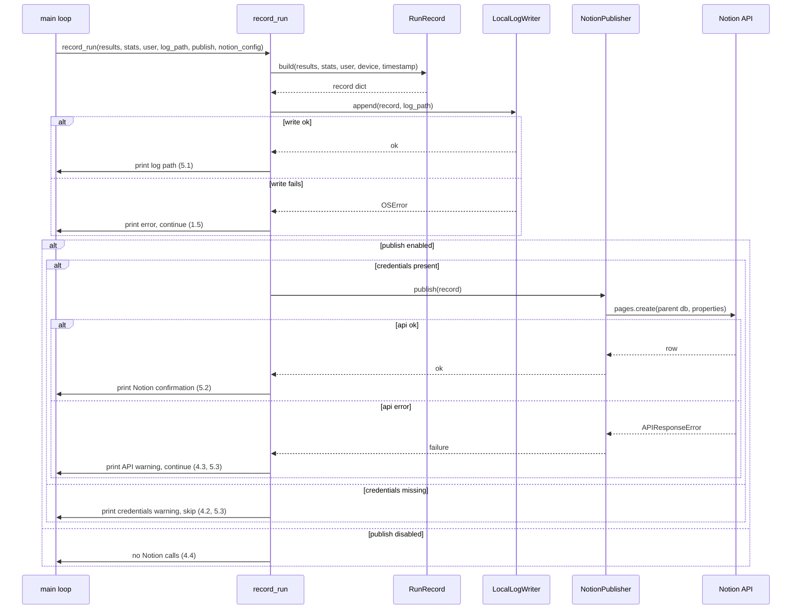

# Design Document

## Overview

**Purpose**: Make every NetProbe run durable. After each completed test run, NetProbe assembles one structured record and always appends it to a local JSON-lines log; when `--publish` is enabled it additionally creates one row in a pre-existing Notion database. This turns a one-shot diagnostic into a tool that accumulates history across runs, locations, and devices.

**Users**: Individuals tracking their connection over time and across locations, and small fleets that want each device's runs to land in a shared Notion database for browsing, filtering, and trend analysis.

**Impact**: Adds always-on local persistence (no flag required) and an optional remote publication path to the existing `main()` test flow. A new self-contained module `data_capture.py` owns the capability; `netprobe.py` changes only at the integration seam (three new CLI flags plus one call per completed run). Existing `--json`/`--csv` exports are unaffected.

### Goals
- Append exactly one structured record per completed run to a local JSONL log, with no extra flag and no data loss on remote failure.
- Optionally publish the same record as one Notion database row, gated by `--publish` and environment credentials.
- Capture run context not present today: ISO 8601 UTC timestamp, user identity, device metadata, and (when available) location.
- Fail safe: local write and Notion publish failures warn but never abort the run.

### Non-Goals
- True hardware GPS (location continues to come from existing IP geolocation only).
- Notion pages (rows only), creating/validating/migrating the Notion database schema, or reading history back from Notion.
- Other publication targets (InfluxDB, webhooks, S3) and real-time streaming.
- Persisting partial/aborted runs — a record is written only after a run completes and statistics are computed.

## Boundary Commitments

### This Spec Owns
- The new module `data_capture.py` and everything in it: record schema, local JSONL writer, Notion publisher, configuration resolution, and the per-run orchestration entry point.
- The canonical run-record schema (field names, types, ISO 8601 UTC timestamp, optional location fields).
- The local log file lifecycle: creation, append semantics, default path, and write-failure handling.
- The Notion property mapping for the documented record fields and the graceful-degradation behavior on missing credentials or API errors.
- The three new CLI options (`--user`, `--publish`, `--log-file`) and their values' resolution against environment variables.

### Out of Boundary
- The measurement engine (`ConnectionTester`, `WiFiSampler`, `StatisticsCalculator`) and the shape of `results`/`stats` — consumed read-only, never modified.
- Existing `Reporter.export_json` / `Reporter.export_csv` and the post-loop `--json`/`--csv` export block — left intact.
- Location detection (`LocationManager`) and VPN handling — consumed read-only.
- Creation or schema management of the Notion database (user responsibility, documented in README).

### Allowed Dependencies
- Read-only consumption of `results` (incl. `wifi_stability`, `location`, `test_scenario`) and `stats` (incl. `quality_score`, `latency_stats`, `packet_loss_stats`, `jitter_stats`, `dns_stats`).
- Standard library: `json`, `os`, `socket`, `platform`, `sys`, `datetime` (with `timezone`).
- New external library: `notion-client >= 3.0` (MIT), lazily imported only on the publish path.

### Revalidation Triggers
- Any change to the keys/shape of `results` or `stats` that the record builder reads.
- A change to the canonical record schema (field rename/removal) — affects both local log consumers and the documented Notion schema.
- A change to the Notion property mapping or required database schema.
- A change to the default log path or log format (JSONL).

## Architecture

### Existing Architecture Analysis
NetProbe is a single CLI entry (`main()` in `netprobe.py`) that orchestrates helper classes (`ConnectionTester`, `StatisticsCalculator`, `Reporter`, `LocationManager`, `VPNManager`, `WiFiSampler`). Sibling capabilities already live in their own modules imported by `netprobe.py` (`vpn_manager.py`, `network_isolation_detector.py`). This feature follows that established pattern with a new `data_capture.py` module, keeping the integration surface in `netprobe.py` minimal and the new domain independently testable.

### Architecture Pattern & Boundary Map



**Architecture Integration**:
- Selected pattern: dedicated capability module behind a single orchestration function (`record_run`), mirroring existing sibling modules.
- Domain boundaries: local persistence (always-on, owns 1.x/2.x) and remote publication (optional, owns 4.x) are separate components; `record_run` sequences them so the local write always precedes the publish attempt (1.6).
- Existing patterns preserved: module-per-capability, static helpers, dict-based result passing, `print(...)` for user feedback.
- New components rationale: one record builder (shared schema), one local writer, one Notion publisher, plus small config helpers — no speculative abstraction.
- Steering compliance: no project steering files exist; design follows the codebase's existing conventions.

### Technology Stack

| Layer | Choice / Version | Role in Feature | Notes |
|-------|------------------|-----------------|-------|
| CLI | `click` (existing) | Adds `--user`, `--publish`, `--log-file` options to `main()` | No version change |
| Backend / Logic | Python 3.13 stdlib (`json`, `os`, `socket`, `platform`, `sys`, `datetime`) | Record build, device info, JSONL append, config resolution | No new dep |
| Data / Storage | Local JSONL file | Append-only durable backup (1.x) | Default `netprobe-results.jsonl` in CWD |
| Integration / External | `notion-client >= 3.0` (MIT) | Optional Notion database-row publication (4.x) | Lazily imported; added to `Pipfile` |

## File Structure Plan

### Directory Structure
```
netprobe/
├── data_capture.py        # NEW: full data-capture-publication domain
│                          #   - DeviceInfo.collect()        (2.3)
│                          #   - RunRecord.build(...)        (2.1-2.6)
│                          #   - LocalLogWriter.append(...)  (1.1-1.6, 5.1)
│                          #   - NotionConfig + load_notion_config()  (4.2)
│                          #   - NotionPublisher.publish(...) (4.1, 4.3-4.5, 5.2-5.3)
│                          #   - resolve_user(...)           (3.1-3.4)
│                          #   - record_run(...)             (orchestration, ordering 1.6)
├── netprobe.py            # MODIFIED: import + 3 CLI flags + one record_run call per run
├── Pipfile                # MODIFIED: add notion-client >= 3.0
└── test/test_netprobe.py  # MODIFIED: add data-capture unit + integration tests
```

### Modified Files
- `netprobe.py` — Add `--user`, `--publish`, `--log-file` Click options and pass-through params to `main()`. Inside the scenario loop, after `stats = StatisticsCalculator.calculate_statistics(results)` and after location is attached, call `record_run(results, stats, user=..., log_path=..., publish=..., notion_config=...)`. Add `timezone` to the `datetime` import if the record builder needs it from here (timestamp is built inside `data_capture.py`).
- `Pipfile` — Add `notion-client = ">=3.0"` to `[packages]`.
- `test/test_netprobe.py` — Add `TestDataCaptureRecord`, `TestLocalLogWriter`, `TestNotionPublisher`, and `TestDataCaptureIntegration` classes.

## System Flows



Key decisions: local write always runs first and unconditionally (1.6); the publish branch is entered only when `--publish` is set (4.4); credential-missing and API-error warnings are distinct messages (5.3).

## Requirements Traceability

| Requirement | Summary | Components | Interfaces | Flows |
|-------------|---------|------------|------------|-------|
| 1.1 | Append one record per run, no extra flag | record_run, LocalLogWriter | `record_run`, `append` | local-write |
| 1.2 | Create log file if absent | LocalLogWriter | `append` | local-write |
| 1.3 | Append without modifying prior records | LocalLogWriter | `append` (JSONL) | local-write |
| 1.4 | Default path in CWD when unset | record_run, CLI | `--log-file` default | local-write |
| 1.5 | Write failure warns, never aborts | LocalLogWriter, record_run | `append` error path | local-write (fail) |
| 1.6 | Local write before remote publish | record_run | sequencing | full sequence |
| 2.1 | ISO 8601 UTC timestamp | RunRecord | `build` | build |
| 2.2 | `user` field (or empty) | RunRecord, resolve_user | `build`, `resolve_user` | build |
| 2.3 | Device metadata | DeviceInfo, RunRecord | `collect`, `build` | build |
| 2.4 | All measurements in record | RunRecord | `build` | build |
| 2.5 | Location fields when collected | RunRecord | `build` | build |
| 2.6 | Omit location when absent, no error | RunRecord | `build` | build |
| 3.1 | `--user` flag value used | resolve_user, CLI | `resolve_user` | build |
| 3.2 | `NETPROBE_USER` fallback | resolve_user | `resolve_user` | build |
| 3.3 | Flag wins over env | resolve_user | `resolve_user` | build |
| 3.4 | Empty string when neither set | resolve_user | `resolve_user` | build |
| 4.1 | Publish creates one Notion row | NotionPublisher | `publish` | publish |
| 4.2 | Missing creds warn + skip | NotionConfig, record_run | `load_notion_config` | publish (no creds) |
| 4.3 | API error logged + skipped | NotionPublisher | `publish` error path | publish (api error) |
| 4.4 | No Notion calls when disabled | record_run | gating | full sequence |
| 4.5 | No schema create/modify/validate | NotionPublisher | `publish` | publish |
| 5.1 | Confirm local log path | record_run | print | local-write |
| 5.2 | Confirm Notion success | record_run | print | publish |
| 5.3 | Distinct skip/fail warnings | record_run, NotionPublisher | print | publish branches |

## Components and Interfaces

| Component | Domain/Layer | Intent | Req Coverage | Key Dependencies (P0/P1) | Contracts |
|-----------|--------------|--------|--------------|--------------------------|-----------|
| DeviceInfo | data capture | Collect host/OS/platform/python metadata | 2.3 | stdlib (P2) | Service |
| RunRecord | data capture | Build canonical flat record from results+stats | 2.1-2.6 | DeviceInfo (P1) | Service |
| LocalLogWriter | data capture | Append record as one JSONL line | 1.1-1.6, 5.1 | filesystem (P0) | Service, State |
| NotionConfig | config | Hold + load Notion creds from env | 4.2 | os.environ (P1) | State |
| NotionPublisher | integration | Create one Notion DB row from record | 4.1, 4.3-4.5, 5.2-5.3 | notion-client (P0, External) | Service, API |
| resolve_user | config | Resolve user identity (flag>env>empty) | 3.1-3.4 | os.environ (P1) | Service |
| record_run | orchestration | Sequence build→local write→optional publish | 1.6, 4.4, 5.1-5.3 | all above (P0) | Service |

Dependency direction within `data_capture.py`: `NotionConfig` / `DeviceInfo` (leaves) → `RunRecord` / `resolve_user` → `LocalLogWriter` / `NotionPublisher` → `record_run`. `netprobe.main` imports only `record_run`, `resolve_user`, and `NotionConfig.from_env`.

### Data Capture

#### DeviceInfo
| Field | Detail |
|-------|--------|
| Intent | Collect device metadata for each record |
| Requirements | 2.3 |

**Responsibilities & Constraints**
- Return a dict with exactly `hostname`, `os`, `platform`, `python_version`.
- Pure/read-only; no exceptions propagate for routine collection (fall back to empty strings on lookup failure).

**Dependencies**
- External: stdlib `socket.gethostname`, `platform.system`/`platform.platform`, `sys.version` (P2)

**Contracts**: Service [x]

##### Service Interface
```python
class DeviceInfo:
    @staticmethod
    def collect() -> dict[str, str]:
        """Return {'hostname', 'os', 'platform', 'python_version'}."""
```
- Preconditions: none.
- Postconditions: all four keys present; values are strings (possibly empty on failure).

#### RunRecord
| Field | Detail |
|-------|--------|
| Intent | Assemble the single canonical flat record consumed by both sinks |
| Requirements | 2.1, 2.2, 2.3, 2.4, 2.5, 2.6 |

**Responsibilities & Constraints**
- Produce a flat `dict` with: `timestamp` (ISO 8601 UTC), `user`, device fields, `test_scenario`, and measurements (`quality_score`, `latency_avg_ms`, `latency_min_ms`, `latency_max_ms`, `jitter_avg_ms`, `packet_loss_percent`, `dns_avg_ms`, `download_speed_mbps`, `wifi_stability_score`, `wifi_score_type`, `avg_snr_db`, `wifi_ssid`).
- Include `latitude`, `longitude`, `city`, `country` only when `results['location']` is present and truthy (2.5); omit those keys entirely otherwise (2.6).
- Read `results`/`stats` defensively with `.get(...)`; missing measurements map to `None`, never raise.

**Canonical field source map** (verified against `netprobe.py`; several measurements are nested — read each via chained `.get(...)` so missing/`None`/`{'error': ...}` intermediates degrade to `None`):

| Record field | Source path |
|--------------|-------------|
| `test_scenario` | `results.get('test_scenario')` |
| `quality_score` | `stats.get('quality_score')` |
| `latency_avg_ms` / `latency_min_ms` / `latency_max_ms` | `stats.get('latency_stats', {}).get('avg_ms' / 'min_ms' / 'max_ms')` |
| `jitter_avg_ms` | `stats.get('jitter_stats', {}).get('avg_ms')` |
| `packet_loss_percent` | `stats.get('packet_loss_stats', {}).get('avg_percent')` |
| `dns_avg_ms` | `stats.get('dns_stats', {}).get('avg_ms')` |
| `download_speed_mbps` | `(results.get('bandwidth') or {}).get('download_speed_mbps')` — note `results['bandwidth']` may be `None` or `{'error': ...}` on failure |
| `wifi_stability_score` / `wifi_score_type` / `avg_snr_db` / `wifi_ssid` | `(results.get('wifi_stability') or {}).get('wifi_stability_score' / 'wifi_score_type' / 'avg_snr_db' / 'wifi_ssid')` |
| `latitude` / `longitude` / `city` / `country` | `results['location'].get('latitude' / 'longitude' / 'city' / 'country')` — only when `results.get('location')` is truthy |

**Dependencies**
- Inbound: record_run (P0)
- Outbound: DeviceInfo (P1)

**Contracts**: Service [x]

##### Service Interface
```python
class RunRecord:
    @staticmethod
    def build(
        results: dict,
        stats: dict,
        user: str,
        device: dict[str, str],
        timestamp: str,
    ) -> dict:
        """Return the canonical flat record dict."""
```
- Preconditions: `timestamp` is ISO 8601 UTC; `device` has the four DeviceInfo keys.
- Postconditions: required keys always present; location keys present iff location was collected.
- Invariants: no key read from `results`/`stats` raises `KeyError`.

#### LocalLogWriter
| Field | Detail |
|-------|--------|
| Intent | Append the record as one JSON line to the log file |
| Requirements | 1.1, 1.2, 1.3, 1.4, 1.5, 5.1 |

**Responsibilities & Constraints**
- Open the target path in append mode, write `json.dumps(record)` + newline, creating the file (and parent dir if a path is given) when absent (1.2).
- Never rewrite or truncate existing content (1.3 — JSONL append).
- On `OSError`/`IOError`, return a failure signal (do not raise) so the caller can warn and continue (1.5).

**Dependencies**
- External: filesystem (P0)

**Contracts**: Service [x] / State [x]

##### Service Interface
```python
class LocalLogWriter:
    def __init__(self, path: str) -> None: ...
    def append(self, record: dict) -> bool:
        """Append record as one JSONL line. Return True on success, False on write failure."""
```
- Preconditions: `path` is a writable target (validated by attempt, not upfront).
- Postconditions: on success, exactly one line appended; prior lines unchanged.

##### State Management
- State model: append-only newline-delimited JSON file; each line is one independent record.
- Persistence & consistency: per-line append; no global rewrite; partial-line risk minimized by single `write` of a fully serialized line.
- Concurrency strategy: out of scope (single-process CLI); concurrent writers are not a supported scenario.

#### NotionConfig + resolve_user
| Field | Detail |
|-------|--------|
| Intent | Resolve identity and Notion credentials from flags/env |
| Requirements | 3.1, 3.2, 3.3, 3.4, 4.2 |

**Responsibilities & Constraints**
- `resolve_user(cli_user)`: return `cli_user` if non-empty (3.1); else `NETPROBE_USER` env value (3.2); flag wins when both set (3.3); empty string when neither (3.4). No error/warning on empty (3.4).
- `NotionConfig.from_env()` / `load_notion_config()`: return a `NotionConfig(token, database_id)` only when both `NOTION_TOKEN` and `NOTION_DATABASE_ID` are present; otherwise return `None` (drives 4.2 skip).

**Contracts**: Service [x] / State [x]

##### Service Interface
```python
@dataclass
class NotionConfig:
    token: str
    database_id: str

    @staticmethod
    def from_env() -> "NotionConfig | None": ...

def resolve_user(cli_user: str | None) -> str: ...
```
- Postconditions: `from_env` returns `None` if either credential is missing (no partial config).

#### NotionPublisher
| Field | Detail |
|-------|--------|
| Intent | Create one Notion database row from the record |
| Requirements | 4.1, 4.3, 4.4, 4.5, 5.2, 5.3 |

**Responsibilities & Constraints**
- Lazily import `notion_client` inside the publisher; construct the client with the config token.
- Map record fields to a documented, fixed set of Notion properties and call `client.pages.create(parent={"database_id": ...}, properties=...)` (4.1).
- Never create, alter, or validate the database schema (4.5); a schema mismatch surfaces as an API error.
- Catch `notion_client.APIResponseError`, transport/timeout errors, and import failure; return a typed failure outcome with a message rather than raising (4.3) so the run continues.

**Dependencies**
- Inbound: record_run (P0)
- Outbound: NotionConfig (P1)
- External: `notion-client >= 3.0` — page creation API (P0)

**Contracts**: Service [x] / API [x]

##### Service Interface
```python
class NotionPublisher:
    def __init__(self, config: NotionConfig) -> None: ...
    def publish(self, record: dict) -> "PublishOutcome":
        """Create one DB row. Return PublishOutcome(ok: bool, error: str | None)."""
```
- Preconditions: `config` has both token and database_id (guaranteed by `from_env`).
- Postconditions: on success exactly one row created; on failure no exception escapes.

##### API Contract
| Method | Endpoint (SDK) | Request | Response | Errors |
|--------|----------------|---------|----------|--------|
| create | `client.pages.create` | `parent={database_id}`, `properties={...}` | created page object | auth, validation (schema mismatch), rate limit, timeout |

Documented Notion property mapping (the database the user pre-creates must contain these properties):

| Notion property | Type | Source record field |
|-----------------|------|----------------------|
| Name | title | `timestamp` (used as row title) |
| Timestamp | date | `timestamp` |
| User | rich_text | `user` |
| Hostname | rich_text | `hostname` |
| OS | rich_text | `os` |
| Quality Score | number | `quality_score` |
| Latency (ms) | number | `latency_avg_ms` |
| Packet Loss (%) | number | `packet_loss_percent` |
| Jitter (ms) | number | `jitter_avg_ms` |
| DNS (ms) | number | `dns_avg_ms` |
| Download (Mbps) | number | `download_speed_mbps` |
| WiFi Score | number | `wifi_stability_score` |
| SSID | rich_text | `wifi_ssid` |
| City | rich_text | `city` (omitted if absent) |
| Country | rich_text | `country` (omitted if absent) |

##### record_run (orchestration)
```python
def record_run(
    results: dict,
    stats: dict,
    user: str,
    log_path: str,
    publish: bool,
    notion_config: "NotionConfig | None",
) -> None:
    """Build the record, append it locally, then optionally publish to Notion."""
```
- Sequence: `RunRecord.build` → `LocalLogWriter.append` (always, 1.6) → if `publish`: when `notion_config` is None print credentials warning and skip (4.2, 5.3); else `NotionPublisher.publish` and print success (5.2) or API warning (4.3, 5.3). When `publish` is False, make no Notion calls (4.4).
- Postconditions: never raises to `main()`; all failures degrade to printed warnings.

**Implementation Notes**
- Integration: called once per scenario iteration in `main()` after stats; `user`/`notion_config` resolved once before the loop, `publish`/`log_path` from CLI.
- Validation: unit tests cover record schema (with/without location), user precedence, JSONL append + failure, Notion mapping + API-error path; integration test runs the full mocked flow.
- Risks: Notion schema mismatch (documented in README; handled as API error); lazy import keeps tests independent of the package.

## Error Handling

### Error Strategy
All failures in this feature degrade gracefully and print a human-readable warning; none abort the run or block other outputs.

### Error Categories and Responses
- **Local write failure (1.5)**: `LocalLogWriter.append` catches `OSError`, returns `False`; `record_run` prints an error line and continues to the publish step.
- **Missing Notion credentials (4.2, 5.3)**: `NotionConfig.from_env` returns `None`; `record_run` prints a credentials-missing warning and skips publication.
- **Notion API/transport error (4.3, 5.3)**: `NotionPublisher.publish` catches `APIResponseError`/transport/timeout/import errors, returns `PublishOutcome(ok=False, error=...)`; `record_run` prints an API-error warning (distinct from the credentials message) and continues.

### Monitoring
- User-facing `print(...)` confirmations and warnings only (consistent with the existing tool). No external telemetry.

## Testing Strategy

### Unit Tests
- `RunRecord.build` includes all required keys and an ISO 8601 UTC `timestamp`; includes location keys when `results['location']` present (2.5) and omits them otherwise (2.6).
- `resolve_user` precedence: flag-only, env-only, both (flag wins, 3.3), neither (empty, 3.4) — patch `os.environ`.
- `DeviceInfo.collect` returns exactly the four expected keys with string values (2.3).
- `LocalLogWriter.append` creates the file when absent and appends one line per call without altering prior lines (1.2, 1.3) — use a `tmp_path`; and returns `False` without raising on a simulated `OSError` (1.5).
- `NotionConfig.from_env` returns `None` when either credential is missing and a populated config when both present (4.2).

### Integration Tests
- `record_run` with `publish=False` writes exactly one local JSONL line and makes no Notion calls (1.1, 4.4) — patch `NotionPublisher` to assert it is never constructed.
- `record_run` with `publish=True` and a mocked `NotionPublisher` returning success appends locally and prints a Notion confirmation (5.1, 5.2).
- `record_run` with `publish=True` and `notion_config=None` prints a credentials warning and skips (4.2, 5.3).
- `record_run` with `publish=True` and a mocked publisher returning `PublishOutcome(ok=False)` prints an API-error warning and still completes (4.3, 5.3).
- `NotionPublisher.publish` maps the record to the documented properties and calls `client.pages.create` with `parent.database_id` (4.1); the API-error path returns a failure outcome without raising (4.3) — mock the lazily-imported `notion_client`.

### Mock Hygiene / Performance
- No real Notion calls, no real network, no real `notion-client` requirement: lazy import is mocked; filesystem uses `tmp_path`.
- Full suite must remain under 1 second per project rule.

## Security Considerations
- `NOTION_TOKEN` is read from the environment only; it is never written to the local log, the Notion payload, or terminal output (warnings reference "credentials", never the value).
- The local log and Notion row contain network measurements, device hostname/OS, optional coarse IP-derived location, and a user-supplied identity string — no secrets. This matches data the tool already collects; publication is opt-in via `--publish`.
