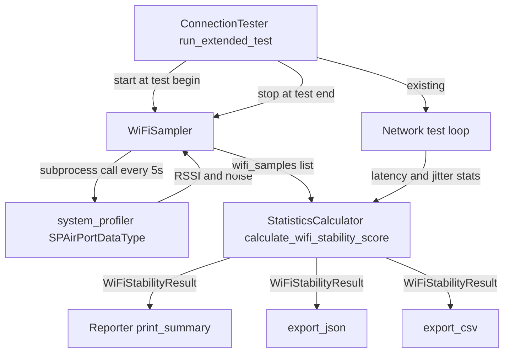
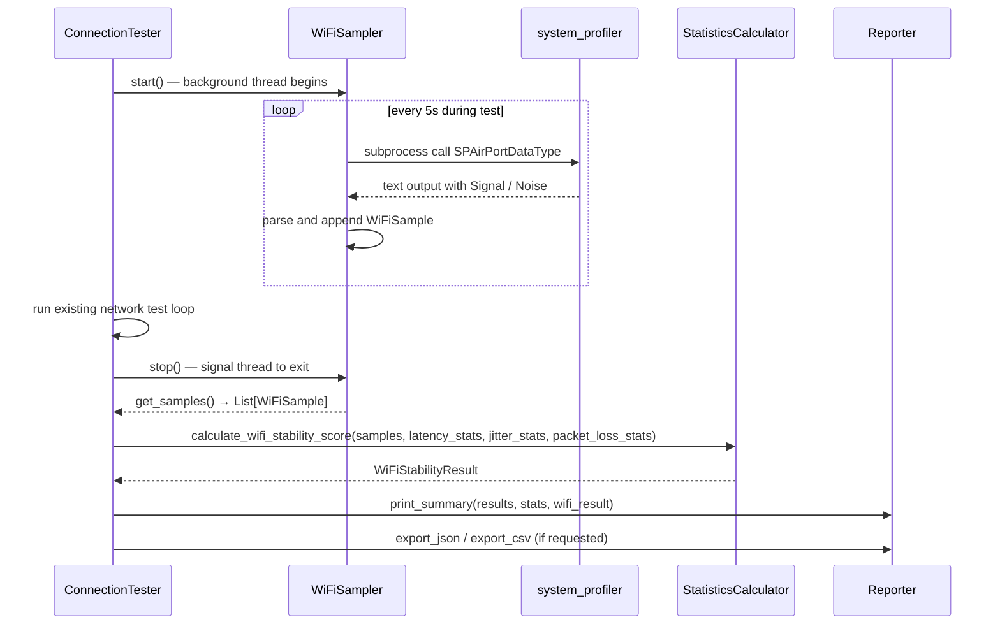

# Design Document: wifi-stability-score

## Overview

This feature extends `netprobe.py` with a dedicated `wifi_stability_score` (0–100) that captures WiFi-specific stability beyond what the existing `quality_score` provides. The score combines radio signal quality (RSSI/SNR sampled over time via `system_profiler` on macOS) with network behavior variance (jitter standard deviation, latency coefficient of variation). On non-macOS or non-WiFi connections, the score degrades gracefully to a behavior-only computation or `null`.

**Users**: Anyone running netProbe at a public WiFi location (hotel, café, airport) who needs to distinguish poor WiFi signal from congested network conditions.

**Impact**: Adds a `WiFiSampler` class and extends `StatisticsCalculator`, `Reporter`, and `ConnectionTester` within the existing single-file architecture. No new pip dependencies. `quality_score` is unchanged.

### Goals
- Sample RSSI/SNR in a background thread during the test run without blocking existing tests (1.1–1.3)
- Produce a `wifi_stability_score` from signal quality + temporal variance on hardware path, and from behavior variance on the fallback path (2.1–2.4)
- Display the score clearly labeled in the terminal summary (3.1–3.5)
- Include score and raw samples in JSON/CSV exports (4.1–4.3)
- Cover all paths with mocked unit tests completing in under 1 second (5.1–5.4)

### Non-Goals
- Channel interference or neighboring AP scanning
- Historical cross-session score tracking
- Desktop/Electron UI changes
- Modifications to `quality_score` logic
- Linux/Windows hardware metric collection (degrade gracefully, no crash)

---

## Boundary Commitments

### This Spec Owns
- `WiFiSampler`: background-thread RSSI/SNR collection on macOS via `system_profiler`
- `StatisticsCalculator.calculate_wifi_stability_score()`: score formula consuming samples + behavior stats
- `ConnectionTester.run_extended_test()` integration: start/stop sampler, store `wifi_samples` in results
- `Reporter.print_summary()` display extension: show `wifi_stability_score` with label and rating band
- JSON export: `wifi_stability_score`, `wifi_score_type`, `wifi_samples` fields
- CSV export: `wifi_stability_score` column in summary and WiFi sample rows
- Unit test coverage for all new components and degradation paths

### Out of Boundary
- `quality_score` logic — must remain unchanged
- Location tracking, VPN comparison, desktop app
- Historical WiFi score persistence across runs
- Cross-platform hardware metric collection beyond macOS `system_profiler`

### Allowed Dependencies
- `ConnectionTester` run loop — sampler integrates via start/stop calls at existing entry/exit points
- `StatisticsCalculator` existing stats output — consumed as behavior inputs to the stability formula
- Python stdlib only: `subprocess`, `threading`, `statistics`, `re`, `time`
- `system_profiler SPAirPortDataType` (macOS system command, no install required)

### Revalidation Triggers
- If `quality_score` formula changes, verify `wifi_stability_score` independence holds (2.5)
- If `results` dict schema in `ConnectionTester` changes, update sampler integration and export paths
- If `Reporter.print_summary()` layout changes significantly, re-check score display position (3.1)
- If `system_profiler` output format changes on a future macOS release, update `WiFiSampler._parse_output()`

---

## Architecture

### Existing Architecture Analysis

`netprobe.py` is a single-file Python application. All classes coexist in one module:

- `ConnectionTester`: runs the test loop, stores results in `self.results` dict
- `StatisticsCalculator`: pure static methods, consumes results, returns stats dict
- `Reporter`: static methods for display and export, consumes results + stats
- Threading: already used in `_test_bandwidth_parallel()` with `threading.Thread` + `queue.Queue`

New components follow this same pattern: classes added to `netprobe.py`, tests added to `test/test_netprobe.py`.

### Architecture Pattern & Boundary Map



**Key decisions**:
- `WiFiSampler` runs in a `threading.Thread` (same pattern as bandwidth parallel test) to avoid blocking the main test loop
- Score calculation is a new static method on `StatisticsCalculator` to stay consistent with the existing pure-function pattern
- `WiFiStabilityResult` is a typed dict passed through `Reporter` the same way `stats` is already passed — no structural change to the call chain

### Technology Stack

| Layer | Choice / Version | Role in Feature |
|-------|-----------------|-----------------|
| Runtime | Python 3.x (existing) | All logic |
| Sampling | `subprocess` stdlib | Call `system_profiler` on macOS |
| Threading | `threading.Thread` stdlib | Background sampler loop |
| Parsing | `re` stdlib | Extract RSSI/noise from `system_profiler` text output |
| Statistics | `statistics` stdlib | std_dev, mean for variance calculations |
| OS detection | `platform.system()` stdlib | Guard non-macOS paths |

No new pip dependencies.

---

## File Structure Plan

### Modified Files

```
netprobe.py               — Add WiFiSampler class; extend StatisticsCalculator,
                            ConnectionTester, Reporter
test/test_netprobe.py     — Add TestWiFiSampler and TestWiFiStabilityScore test classes
```

All changes are confined to these two files. No new files are introduced (consistent with the single-file module pattern).

**Sections added to `netprobe.py`** (in declaration order):
1. `WiFiSample` TypedDict (after existing imports)
2. `WiFiStabilityResult` TypedDict
3. `WiFiSampler` class (after `ConnectionTester`, before `StatisticsCalculator`)
4. `StatisticsCalculator.calculate_wifi_stability_score()` static method (appended to class)
5. `ConnectionTester.run_extended_test()` — two insertion points: sampler start (pre-loop) and sampler stop + score calculation (post-loop)
6. `Reporter.print_summary()` — one insertion point after `quality_score` display
7. `Reporter.export_json()` — merge `WiFiStabilityResult` fields into output dict
8. `Reporter.export_csv()` — append wifi_stability_score and sample rows

---

## System Flows

### Test Run Sequence



**Key decisions**: `stop()` sets a threading `Event` flag; the sampler thread checks it between samples. `get_samples()` is safe to call only after `stop()` returns (thread joined with a 2-second timeout).

---

## Requirements Traceability

| Requirement | Summary | Component | Interface / Method |
|-------------|---------|-----------|-------------------|
| 1.1 | Start WiFi sampling on macOS WiFi | WiFiSampler, ConnectionTester | `WiFiSampler.start()` |
| 1.2 | Record sample as typed data point | WiFiSampler | `WiFiSample` TypedDict |
| 1.3 | Stop sampler, expose samples after test | WiFiSampler, ConnectionTester | `WiFiSampler.stop()`, `get_samples()` |
| 1.4 | Skip sampling on non-WiFi connection | WiFiSampler | `_is_wifi_connected()` guard |
| 1.5 | Warn and skip on parse failure | WiFiSampler | `_parse_output()` with try/except |
| 1.6 | Skip on non-macOS without error | WiFiSampler | `platform.system()` guard in `start()` |
| 2.1 | Compute score from SNR + behavior variance | StatisticsCalculator | `calculate_wifi_stability_score()` |
| 2.2 | Score is integer 0–100 | StatisticsCalculator | Return type `int` clamped to [0, 100] |
| 2.3 | Behavior-only path when no samples | StatisticsCalculator | Branch on `len(samples) == 0` |
| 2.4 | No variance penalty with < 2 samples | StatisticsCalculator | Skip std_dev if `len(samples) < 2` |
| 2.5 | Independent of quality_score | StatisticsCalculator | Separate method, no shared mutable state |
| 3.1 | Display after quality_score | Reporter | `print_summary()` insertion point |
| 3.2 | Label + avg SNR when hardware-backed | Reporter | Conditional on `wifi_score_type == "hardware"` |
| 3.3 | Label as behavior-only when no hardware | Reporter | Conditional on `wifi_score_type == "behavior-only"` |
| 3.4 | Same rating bands as quality_score | Reporter | Shared band lookup |
| 3.5 | Display N/A when score is null | Reporter | Null guard in display |
| 4.1 | JSON: score, type, samples | Reporter.export_json | Merge `WiFiStabilityResult` into output |
| 4.2 | CSV: score column + sample rows | Reporter.export_csv | Append wifi fields |
| 4.3 | Empty samples → empty list in JSON | Reporter.export_json | Default `wifi_samples: []` |
| 5.1 | Mock all subprocess calls in tests | test_netprobe.py | `@patch('subprocess.run')` |
| 5.2 | Verify RSSI/noise/SNR parsing | TestWiFiSampler | Parse correctness assertions |
| 5.3 | Cover all 4 score paths | TestWiFiStabilityScore | Parametrized test cases |
| 5.4 | Full suite under 1 second | test_netprobe.py | All I/O mocked |

---

## Components and Interfaces

| Component | Domain | Intent | Req Coverage | Key Dependencies |
|-----------|--------|--------|--------------|-----------------|
| `WiFiSampler` | Sampling | Background RSSI/SNR collection | 1.1–1.6 | `subprocess`, `threading`, `platform` (all stdlib) |
| `StatisticsCalculator.calculate_wifi_stability_score` | Scoring | Produce `wifi_stability_score` from samples + behavior stats | 2.1–2.5 | `statistics` stdlib, `WiFiSample` list |
| `ConnectionTester` (modified) | Integration | Start/stop sampler, store samples in results | 1.1, 1.3 | `WiFiSampler` |
| `Reporter` (modified) | Output | Display and export wifi score | 3.1–3.5, 4.1–4.3 | `WiFiStabilityResult` |

---

### Sampling Layer

#### `WiFiSampler`

| Field | Detail |
|-------|--------|
| Intent | Sample RSSI/SNR from `system_profiler` in a background thread; expose typed sample list |
| Requirements | 1.1, 1.2, 1.3, 1.4, 1.5, 1.6 |

**Responsibilities & Constraints**
- Owns all interaction with `system_profiler SPAirPortDataType`
- Runs in exactly one background thread; no nested threads
- Exposes a clean start/stop/get interface; callers do not know about threading internals
- Does not compute scores; only collects raw samples

**Dependencies**
- External: `system_profiler SPAirPortDataType` (macOS system command) — P0 for hardware path
- Outbound: `StatisticsCalculator.calculate_wifi_stability_score()` — consumes samples (P0)
- Inbound: `ConnectionTester.run_extended_test()` — calls start/stop (P0)

**Contracts**: Service [x]

##### Service Interface

```python
from typing import TypedDict, Optional, List
import threading

class WiFiSample(TypedDict):
    timestamp: float       # Unix epoch seconds
    rssi_dbm: int          # Signal level in dBm (typically -30 to -90)
    noise_dbm: int         # Noise floor in dBm (typically -90 to -100)
    snr_db: int            # Computed: rssi_dbm - noise_dbm

class WiFiSampler:
    def __init__(self, interval_seconds: int = 5) -> None: ...

    def start(self) -> None:
        """Start background sampling thread. No-op on non-macOS or non-WiFi."""

    def stop(self) -> None:
        """Signal thread to stop and join (2s timeout). Safe to call if not started."""

    def get_samples(self) -> List[WiFiSample]:
        """Return collected samples. Call only after stop()."""

    def _is_wifi_connected(self) -> bool:
        """Return True if active interface is WiFi (not ethernet/VPN)."""

    def _parse_output(self, output: str) -> Optional[WiFiSample]:
        """Parse system_profiler text output. Return None on parse failure."""

    def _sample_loop(self) -> None:
        """Thread target: loop until stop event set, calling system_profiler each interval."""
```

- Preconditions: `get_samples()` must be called after `stop()` returns
- Postconditions: `stop()` guarantees thread is no longer running when it returns
- Invariants: `_samples` list is only appended in the sampler thread; `get_samples()` reads after join, so no mutex needed

**Implementation Notes**
- Integration: `threading.Event` for stop signaling (same pattern as stdlib examples); `threading.Thread(daemon=True)` so it doesn't block process exit
- Validation: Regex `Signal / Noise: (-?\d+) dBm / (-?\d+) dBm` against `system_profiler` output; skip sample if no match
- Risks: `system_profiler` can take 1–2 seconds on some macOS versions — 5s interval keeps this within budget; if a single call exceeds interval, next sample is skipped (not queued)

---

### Scoring Layer

#### `StatisticsCalculator.calculate_wifi_stability_score()`

| Field | Detail |
|-------|--------|
| Intent | Pure function: compute wifi_stability_score from WiFi samples and existing behavior stats |
| Requirements | 2.1, 2.2, 2.3, 2.4, 2.5 |

**Responsibilities & Constraints**
- Stateless pure function; no side effects
- Must not read or write `quality_score`
- Clamps output to [0, 100]

**Contracts**: Service [x]

##### Service Interface

```python
class WiFiStabilityResult(TypedDict):
    wifi_stability_score: Optional[int]  # None if unavailable
    wifi_score_type: str                 # "hardware" | "behavior-only" | "unavailable"
    wifi_samples: List[WiFiSample]
    avg_snr_db: Optional[float]          # None if no hardware samples

@staticmethod
def calculate_wifi_stability_score(
    samples: List[WiFiSample],
    latency_stats: dict,
    jitter_stats: dict,
    packet_loss_stats: dict,
) -> WiFiStabilityResult: ...
```

##### Score Formula

**Hardware path** (≥1 sample):

| Condition | Penalty |
|-----------|---------|
| avg SNR < 10 dB | -40 |
| avg SNR < 20 dB | -20 |
| avg SNR < 30 dB | -10 |
| SNR std_dev > 10 (≥2 samples) | -20 |
| SNR std_dev > 5 | -10 |
| SNR std_dev > 2 | -5 |
| latency CoV > 0.5 | -15 |
| latency CoV > 0.2 | -7 |
| jitter std_dev > 10 ms | -10 |
| jitter std_dev > 5 ms | -5 |

SNR variance penalty skipped when `len(samples) < 2` (requirement 2.4).

**Behavior-only path** (0 samples, latency/jitter stats available):

| Condition | Penalty |
|-----------|---------|
| avg packet loss > 1% | -30 |
| avg packet loss > 0.1% | -15 |
| latency CoV > 0.5 | -20 |
| latency CoV > 0.2 | -10 |
| jitter std_dev > 15 ms | -20 |
| jitter std_dev > 8 ms | -10 |

**Unavailable path**: no samples, no behavior stats → return `null`, type `"unavailable"`.

**Implementation Notes**
- Integration: Called in `ConnectionTester.run_extended_test()` after `WiFiSampler.stop()` and after `StatisticsCalculator.calculate_statistics()`
- Validation: CoV = std_dev / mean; guard against mean == 0 (return CoV = 0)
- Risks: None — pure arithmetic

---

### Integration Points (Modified Classes)

#### `ConnectionTester` modifications

Two insertion points in `run_extended_test()`:

1. **Before test loop**: instantiate and start `WiFiSampler`; store reference in local variable
2. **After test loop**: call `sampler.stop()`; store `sampler.get_samples()` in `self.results['wifi_samples']`; call `StatisticsCalculator.calculate_wifi_stability_score()`; store `WiFiStabilityResult` in `self.results['wifi_stability']`

#### `Reporter` modifications

**`print_summary()`** — after existing `quality_score` display block:
- If `wifi_result['wifi_score_type'] == 'unavailable'`: print `WiFi Stability Score: N/A`
- If hardware: print `WiFi Stability Score: {score}/100 ({rating}) | Avg SNR: {snr:.1f} dB`
- If behavior-only: print `Connection Stability Score (behavior only): {score}/100 ({rating})`
- Rating lookup: same thresholds as `quality_score` (≥90 Excellent, ≥80 Good, ≥70 Fair, <70 Poor)

**`export_json()`** — merge into output dict:
```python
{
  "wifi_stability_score": wifi_result["wifi_stability_score"],
  "wifi_score_type": wifi_result["wifi_score_type"],
  "wifi_samples": wifi_result["wifi_samples"],
  "avg_snr_db": wifi_result["avg_snr_db"]
}
```

**`export_csv()`** — two additions:
- Add `wifi_stability_score` column to the summary header/row
- Write WiFi sample rows with columns: `wifi_timestamp,rssi_dbm,noise_dbm,snr_db`

---

## Data Models

### Domain Model

```
WiFiSample
  timestamp: float        # epoch seconds
  rssi_dbm: int           # radio signal level
  noise_dbm: int          # noise floor
  snr_db: int             # signal-to-noise ratio (rssi - noise)

WiFiStabilityResult
  wifi_stability_score: Optional[int]   # 0-100 or None
  wifi_score_type: Literal["hardware","behavior-only","unavailable"]
  wifi_samples: List[WiFiSample]        # raw time series
  avg_snr_db: Optional[float]           # summary for display
```

**Invariants**:
- `snr_db == rssi_dbm - noise_dbm` always
- `wifi_stability_score` is None iff `wifi_score_type == "unavailable"`
- `avg_snr_db` is None iff `wifi_score_type != "hardware"`

---

## Error Handling

### Error Strategy

Follow the existing codebase pattern: log warnings, degrade gracefully, never crash the test run.

| Error Condition | Response |
|----------------|---------|
| Non-macOS platform | Skip sampler silently; use behavior-only or unavailable path |
| Not on WiFi | Skip sampler; use behavior-only path |
| `system_profiler` subprocess fails (non-zero exit) | Log warning; skip that sample; continue |
| `system_profiler` output unparseable | Log warning per sample; skip sample |
| Sampler thread exceeds 2s join timeout | Log warning; proceed with partial samples collected |
| No behavior stats available | Return `wifi_score_type: "unavailable"`, `wifi_stability_score: None` |

### Monitoring
Warnings printed to stderr using existing `print()` pattern (no new logging infrastructure). All warning messages prefixed with `⚠️` consistent with existing codebase style.

---

## Testing Strategy

### Unit Tests (`TestWiFiSampler`)
1. `test_parse_output_valid` — mock `system_profiler` text with known signal/noise; assert RSSI, noise, SNR parsed correctly (req 5.2)
2. `test_parse_output_invalid` — pass malformed text; assert `None` returned, no exception (req 1.5)
3. `test_is_wifi_connected_false_on_non_wifi` — mock `networksetup` output for ethernet; assert returns `False` (req 1.4)
4. `test_start_noop_on_non_macos` — mock `platform.system()` to return `"Linux"`; assert no thread started (req 1.6)
5. `test_stop_after_start` — mock subprocess; assert `get_samples()` returns typed list after `stop()` (req 1.3)

### Unit Tests (`TestWiFiStabilityScore`)
1. `test_hardware_path_multiple_samples` — pass 3 valid samples + behavior stats; assert score is int in [0,100], type is "hardware" (req 2.1, 2.2)
2. `test_hardware_path_single_sample_no_variance_penalty` — pass 1 sample; assert score does not apply SNR variance penalty (req 2.4)
3. `test_behavior_only_path` — pass empty samples + behavior stats; assert type is "behavior-only", score reflects jitter/latency/packet-loss penalties (req 2.3)
4. `test_unavailable_path` — pass empty samples + empty behavior stats; assert score is None, type is "unavailable" (req 3.5)
5. `test_independence_from_quality_score` — run both calculations on same inputs; assert neither modifies shared state (req 2.5)

### Integration Tests
1. `test_full_run_includes_wifi_result` — mock `WiFiSampler` to return 2 samples; run `ConnectionTester`; assert `results['wifi_stability']` present and score is int (req 1.1–1.3, 2.1)
2. `test_json_export_includes_wifi_fields` — mock full run; call `export_json()`; assert all 4 wifi fields present (req 4.1, 4.3)
3. `test_csv_export_includes_wifi_score` — mock full run; call `export_csv()`; assert wifi_stability_score in CSV output (req 4.2)

### Performance
- All subprocess and network calls mocked; full suite completes in < 1 second (req 5.4)
- `WiFiSampler` uses 5s interval — no risk of slowing test run (req 1.1 background thread)
